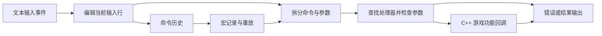

# 喵喵的结合：控制台与回溯机制

检查日期：2026-09-13。依据本机 `Mewgenics.exe` 字符串、少量代码引用、GPAK 配置和现有存档结构。没有开启调试模式、执行游戏命令或改动用户存档。

**《喵喵的结合》确实有内嵌调试控制台，而且有历史记录、宏和参数检查线索。** 但控制台的存在，不足以证明它提供《陷阵之志》那样的通用逐步撤销。本次确认了存档、备份和回放测试相关结构，尚未确认一个可供玩家任意撤销上一动作的接口。

## 1. 控制台入口

本机程序中存在 `enable_debugconsole` 配置键及 `glaiel::DebugConsole` 的 C++ 类型信息。公开的 Mewtator 启动器源码在启用调试控制台时，给游戏添加以下启动参数：

```text
-enable_debugconsole true
```

这是可以核对的启动方式，来源为 [Mewtator 的游戏启动参数构建代码](https://github.com/dancomstock/mewtator/blob/main/app/core/services/game_launcher_service.py)。该源码同时把 `-dev_mode true` 作为另一选项处理，不能把两个开关自动视为同一个功能。

本机用户配置位于 `%APPDATA%/Glaiel Games/Mewgenics/<用户目录>/settings.txt`；检查时未发现显式启用 `enable_debugconsole` 的配置行。这不能证明运行进程没有通过启动参数启用它。本次没有实测打开按键，也不把网上流传的键位差异当成已验证结果。

这里只分析游戏内部控制台。网络上的某些 Mod 也有自己的 Windows 调试窗口，它们不能作为原作控制台的实现证据。

## 2. 程序中有哪些具体实现线索

| 本机证据 | 解释 |
|---|---|
| RTTI 中的 `DebugConsole@glaiel` | 控制台属于游戏原生 C++ 类型体系 |
| `DebugConsole::init` 相关 lambda 类型 | 初始化阶段关联了原生回调 |
| 回调类型含 `vector<string>` | 支持把参数列表传给命令处理回调的解释 |
| 与 `SDL_Event` 绑定的方法类型 | 控制台接入事件系统的线索；完整按键逻辑未还原 |
| 未知命令、参数不足、执行完成等提示片段 | 存在命令查找、参数数量检查和输出反馈 |
| `debug_console_history.txt` | 存在命令历史文件路径 |
| `debug_console_macros.txt` | 存在宏持久化文件路径 |
| `record_macro`、`end_recording_macro`、`save_commands_as_macro` | 存在录制/保存命令宏的功能线索 |
| `clear_history`、`clear_macros` | 历史记录与宏有独立管理入口 |

这些证据比仅发现 `console` 字样更具体，支持“命令分派 + 参数列表 + C++ 回调”的结构解释。但仅凭 RTTI 仍不能确定注册表底层是哈希表、树还是顺序表，也没有证据表明它使用 Lua 执行器。



图为解释模型，不是恢复出的完整调用图。引号、转义、自动补全和宏的准确执行时序还未确认。

## 3. 历史回溯、宏重放与战斗回溯的区别

如果说的是命令行历史回溯，那么只需要保存曾输入的文本，向前或向后移动游标，再把那一行放回输入框。原作的历史文件名支持它具备历史记录机制，但上下键等具体交互未在本机验证。

宏记录的也是命令序列。重新执行同一条“生成敌人”命令，可能生成另一个敌人；它不会自然地把世界恢复到命令之前。要把宏用于稳定复现，还需相同的初始世界、配置、随机状态与执行时序。

```cpp
// 说明性伪代码，不是原作源码。
struct CommandSpec {
    int minArgs;
    Function<void(Vector<string>)> callback;
};

void Submit(string line, SubmitOrigin origin) {
    auto parsed = ParseQuotedArguments(line);  // 示例选择支持引号
    if (!parsed || parsed.tokens.empty()) return;
    auto spec = FindCommand(parsed.tokens.front());
    if (!spec) { PrintUnknownCommand(); return; }
    auto args = parsed.tokens.afterFirst();
    if (args.size() < spec.minArgs) { PrintUsage(spec); return; }

    if (origin == UserInput) history.push_back(line);
    if (recording && origin == UserInput && !IsMacroControl(line))
        recordedMacro.push_back(line);
    spec.callback(args);
}

void RecallPreviousInput() {
    if (history.empty()) return;
    historyCursor = max(0, historyCursor - 1);
    inputLine = history[historyCursor];  // 仅恢复文本，不执行命令
}
```

原作还有“正在录宏时不能再次录宏”等提示线索。自己的实现中应限制宏递归和每次执行预算，并区分用户提交与宏展开，避免宏把自己反复录进去；这些限制的完整原作策略未还原。

## 4. 存档恢复：有数据基础，但不能据此保证任意撤销

本机 `steamcampaign01.sav` 的文件头是 `SQLite format 3`。用只读方式读取数据库结构，可见 `cats`、`furniture`、`files`、`properties`、`winning_teams` 五张表；其中多个表把游戏数据保存在 BLOB 列。

`files` 表中的键包括 `adventure_state`、`chapter_map`、`house_state`、`inventory_backpack`、`npc_progress`、`tutorial_tokens` 等；`properties` 中可见 `random_seed` 和 `savescumlocation` 等键。这里只报告结构，不发布用户的猫、冒险数据或属性值。

这些证据说明游戏可以持久化并重建多种状态，但没有证明每次攻击前都自动保留一个可恢复快照。BLOB 内部的序列化格式、覆盖时机和加载规则还没有在本次完整解析。

程序还包含 `save_autobackup_minutes`、`save_autobackup_count`、`.savbackup` 等字符串。这支持定期备份配置的存在；备份间隔与保留数量的实际默认值、当前是否生成备份，不能只靠这些名字确定。

## 5. 几个非常容易被误认为“撤销”的线索

| 线索 | 本次能够确认的内容 | 不能直接下的结论 |
|---|---|---|
| `soft_reset` | 程序中有该命令名线索 | 不能承诺它撤销最近攻击，或保证回到某个战斗检查点 |
| `reset_turn` | 有原生字符串比较分支，邻近 `dialog`、`clear_token`、`lock_controls` 等处理 | 尚未证明它注册为玩家控制台命令，更未确认它恢复什么 |
| `replay_test`、`replay_test_full`、`replay_test_fast`、`replay_info.txt` | 存在回放测试相关入口/路径 | 不证明玩家可任意倒带，也未确认回放数据是命令流还是状态流 |
| `UndoDamage` | Medic 的 `ReverseDamage` 技能配置引用该效果 | 局部伤害处理不是恢复棋盘、行动点与全部角色状态 |
| `ROLLBACK` | SQLite 事务术语及相关错误信息 | 数据库事务回滚不是“上一回合撤销” |
| `Rewind` | 位于 SQLite 操作码字符串序列中，周围有 `IdxLE`、`Sort`、`SorterSort` | 不是证明游戏有时间倒带的证据 |
| `Undo`、`MediaRewind` | 出现在通用输入名称区域 | 键名不能证明绑定了某个玩法功能 |

其中 SQLite 的 `Rewind` 表示把数据库游标移到表/索引开头；SQLite 的字节码文档可直接核对这一含义，见 [SQLite opcode：Rewind](https://sqlite.org/opcode.html#Rewind)。

`ReverseDamage` 的资源位置为 `data/abilities/medic_abilities.gon`，其效果块写有 `UndoDamage 1`。该资源提供技能级处理证据，但本次尚未还原它究竟记录哪些伤害、如何处理升级与特殊状态。

另有 `POPUP_TRY_SAVESCUM_BATTLE`、`POPUP_TRY_SAVESCUM_WARNING_1/2` 等 UI 文本键及对应存档属性线索，说明重新尝试/读档行为还有专门逻辑。没有追踪完整分支前，不对重试次数、后果或绕过方式作猜测。

## 6. 如果自己的战棋要同时支持控制台、撤销与回放

这三项能力应共享规则层接口，但分别保存不同数据：

| 系统 | 保存内容 | 用途 |
|---|---|---|
| 控制台历史 | 输入文本 | 找回并编辑旧命令 |
| 命令宏 | 多条命令及参数 | 批量执行测试操作 |
| 战斗快照 | 棋盘、实体、任务、行动阶段和 RNG 状态 | 恢复指定逻辑时刻 |
| 确定性回放 | 初始状态、规则版本、顺序化输入及必要随机信息 | 重新运行同一过程 |

推荐的 C++ / ECS 与蓝图边界如下，这是项目设计建议，不代表原作使用 ECS 或虚幻：

```cpp
void RunDebugAction(ValidatedCommand cmd) {
    // UI 和控制台都走同一套规则接口，避免绕过状态约束。
    ActionResult result = rules.Execute(cmd);
    presentation.Show(result);
}

bool RestoreDebugCheckpoint(Checkpoint cp) {
    auto candidate = DeserializeAndValidate(cp);
    if (!candidate) return false;

    PauseGameplayInput();
    ++presentationGeneration;
    CancelPendingAnimationCallbacks();
    rules.ReplaceWorld(candidate.world);
    rules.RestoreRandomState(candidate.rng);
    presentation.RebuildFrom(rules.GetViewSnapshot());
    ResumeGameplayInput();
    return true;
}
```

C++ 计算层拥有真实状态和快照；蓝图表现层接收结果、显示动画，恢复时按逻辑数据重建。旧延迟回调需要带播放代次或世界代次检查，避免回溯后又把上一时刻的伤害特效/单位移动应用回来。

真正的任意逐步撤销还需要在每个允许撤销的边界保存快照或完整修改记录；仅有 SQLite 自动存档和一个命令输入框并不够。确定性回放也要考虑 RNG 调用顺序、实体遍历顺序和规则版本，不能只固定地图种子。

## 7. 复核位置与范围

本机 `Mewgenics.exe` SHA-256：`4127cd6a792ae528bca6f65a8873dd61789591937d87656c2b586a5e30eb77ea`。

| 文件偏移或路径 | 用途 |
|---|---|
| EXE `0x01131248`、`0x01131300` | 历史与宏文件名 |
| EXE `0x011313F0` | `enable_debugconsole` |
| EXE `0x013B14C8` 附近 | `glaiel::DebugConsole` 类型信息 |
| EXE `0x01123848` | `reset_turn` 字符串；代码引用 VA 为 `0x1408EFB1A` |
| EXE `0x01135BD8` 附近 | SQLite `Rewind` 及相邻操作码 |
| GPAK `data/abilities/medic_abilities.gon` | ReverseDamage / UndoDamage 配置 |
| 用户存档 `saves/steamcampaign01.sav` | SQLite 表结构与状态条目名称 |

偏移只对应本机这一文件，VA 为静态首选地址。反汇编工具可能以远处的导出符号标注无符号函数，不能把那种显示名称当作真实类/函数名。本次没有完成控制台按键实测、回放文件解析或原生撤销接口验证。
