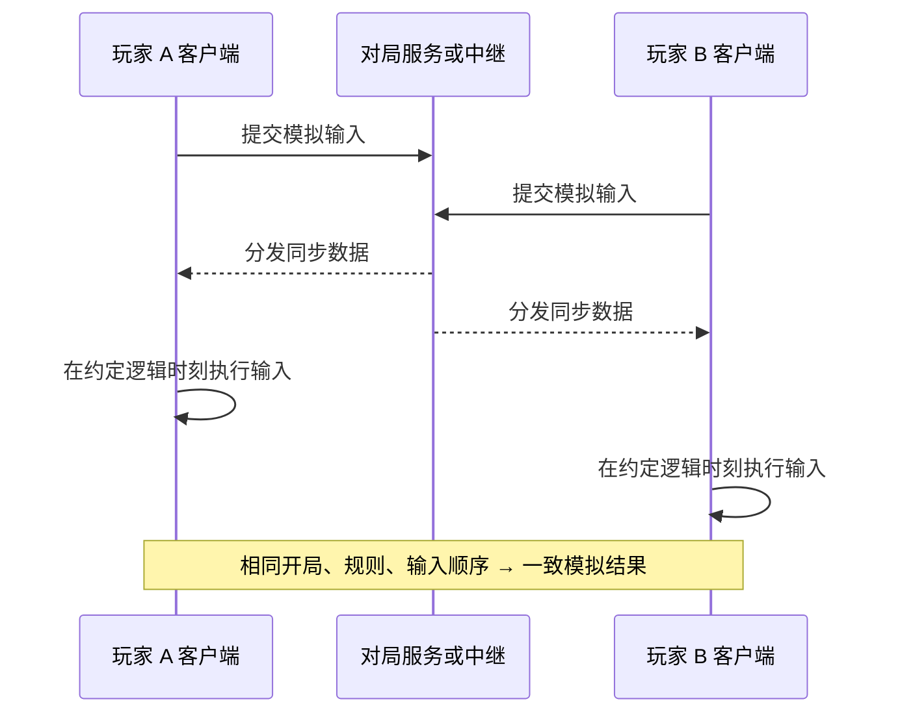

# 帝国时代 IV：网络同步系统分析

检查日期：2026-09-13。依据本机程序、回放结构、网络相关文本和同步错误日志的结构，以及开发者公开演讲简介和官方支持资料。本文使用 C++ 风格伪代码解释设计，不提供原作协议实现。

**最有依据的架构判断是：客户端进行确定性模拟，通过同步命令保持对局一致，并有战斗服务器中继相关组件参与连接。** 上行与下行的重点是模拟输入和会话控制；不能把它理解为每帧上传所有士兵坐标，再下载服务器生成的画面。

**任何系统都不能保证连接永远不断。** 可以处理短暂丢包、延迟和部分连接中断，但网络长期不可达、进程退出或服务器停机，都可能中止对局。帝国时代官方明确说明服务器维护会打断正在进行的多人比赛，见[服务器维护说明](https://support.ageofempires.com/hc/en-us/articles/4410144291604-Server-Maintenance)。

后续已完成[自定义网络协议与消息格式](自定义网络协议与消息格式.md)的只读运行时代码分析，确认了部分消息字段及中继计时常量。本篇保留第一轮架构分析的证据范围，相关新增结论与限定条件见后续篇。

## 1. 哪些已确认，哪些仍是推断

| 本机或公开证据 | 支持的结论 | 证据边界 |
|---|---|---|
| 开发者 GDC 演讲简介要求不同 CPU 核数下得到相同模拟结果 | 确定性模拟是原作明确的工程目标 | 未从简介恢复出全部线程和浮点策略 |
| 两份 `.rec` 完整包含 tick → 块 → 命令结构 | 原作存在可记录与重演的模拟输入流 | 回放记录布局不等于线上网络包布局 |
| `GameMsgSyncCommand::StreamMessageOut/In` | 同步命令有序列化与反序列化路径 | 不知道线上封包、压缩和加密的完整格式 |
| `ServerSynchronization::RegisterPeer`、`OnDestroyedPeerEvent` | 同步策略维护参与方，并处理移除事件 | 名称中的 Server/Peer 不足以判断完整网络拓扑 |
| `BattleServerRelay`、`RL_BATTLESERVER_USE_RAW_SOCKETS` | 程序包含战斗服务器中继及传输选择相关代码 | 未确认本次版本、平台、对局实际选择的传输路径 |
| `MatchHeartbeat`、`PresenceHeartbeat`、多个重连标识 | 存在心跳与重连相关机制 | 各自属于哪条连接、实际间隔和超时值未确认 |
| 同步错误回调、CRC 诊断和本地同步转储 | 程序具备发现与诊断状态不一致的能力 | 不代表会自动修复所有不同步 |

开发者 Joel Pritchett 的 [GDC 2022 演讲简介](https://www.gdcvault.com/play/1027610/The-MAW-Safely-Multithreading-the) 明确把跨不同 CPU 配置得到一致模拟结果作为目标。这里引用公开简介，未声称已经观看完整演讲或检查其全部源码。

## 2. 上行和下行分别传什么

本机回放及同步消息标识支持“命令驱动”的解释。以下是功能层面的数据划分，不是逐字节抓包结果：

| 阶段 | 上行：客户端发出 | 下行：客户端接收 | 确认程度 |
|---|---|---|---|
| 登录、组队、开局 | 会话请求、准备情况、房间操作 | 服务状态、房间成员、对局启动信息 | 有在线服务和同步注册相关证据，完整字段未知 |
| 对局模拟 | 移动、训练、建造等输入对应的同步命令 | 同步输入及参与方变化等消息 | 命令序列化路径与回放结构支持；线上批处理规则未知 |
| 活性维护 | 心跳、状态或性能相关报告 | 活性响应、连接状态或服务事件 | 有 `MatchHeartbeat`、`MatchHeartbeatPerformance` 等标识 |
| 一致性检查 | 可能包含用于比较的校验信息 | 校验/同步错误相关信息 | 观察者校验消息与同步错误路径已发现；完整交换方式未知 |
| 周边服务 | 回放上传、统计、聊天等 | 对应服务响应和内容 | 存在回放上传、聊天、在线状态等独立功能标识 |

例如，选中一组弓箭手移动到某处，可以用“相关实体标识、移动命令、目标位置、执行顺序”等输入表达。随后各客户端用一致的寻路、移动和战斗规则推进世界。原作消息可能另含系统事件、镜头记录或其他数据，不能断言“网络永远只传玩家操作”。

这一设计的优势是带宽主要随输入活动量和协议开销增长，不必单纯随每个单位的每帧位置变化增长。实际一秒上传多少 KB、每包多少条命令，本次没有测量，不能用 `.rec` 文件大小代替网络带宽统计。

## 3. 服务端与客户端怎样配合

下面是与现有证据相符的解释模型。服务端具体在哪一层分配顺序、是否运行额外模拟或校验，仍未确认。



**使用服务器中继，与服务器计算所有单位状态，是两种不同的职责。** 发现 `BattleServerRelay` 不能证明服务器完全不运行模拟，也不能证明所有血量、寻路都由服务器权威计算。本次没有服务端程序，不能下这两种结论。

## 4. 为什么命令要排队，网络卡时单位可能等待

确定性同步需要保证：参与客户端在同一个逻辑步骤使用相同的输入及顺序。若某份必要输入尚未到达，随意把它当成“没有操作”继续执行，可能造成永久分叉。

通常可以提前安排输入执行时刻，留出传输和抖动缓冲。例如自建系统在 tick 100 收到用户操作，将其安排至 tick 103；这些数字仅为教学示例，并非帝国时代 IV 的实测参数。其他客户端有时间收到同一输入，再一起执行。

需要区分四个频率：

| 频率 | 含义 |
|---|---|
| 网络发包频率 | 多久发送一次数据；可以合并多个输入 |
| 命令执行/同步频率 | 输入在哪些逻辑时刻生效 |
| 模拟系统更新频率 | 移动、AI 等系统的更新节奏，可能不完全相同 |
| 渲染 FPS | 多久显示一张画面 |

本机有 `totalAverageCommandDelay`，支持原作关注命令延迟，但没有确认自适应输入延迟公式。上一轮格式研究模板中的 8 tick/秒也不足以证明当前网络固定每秒发 8 包。

缓冲太小容易等待网络，太大则操作反馈迟。碰到缺少必要输入时，保守的锁步实现暂停模拟推进，同时继续处理网络和界面。镜头还能移动、界面还能响应，并不表示战斗模拟仍在推进。此处解释的是设计原理，本次未实机测试原作各类卡顿的具体表现。

## 5. 丢包、乱序和重复怎样处理

要做到“短暂网络问题不立刻毁掉对局”，可靠交付与模拟同步必须配合：

| 问题 | 自建系统需要的处理 | 为什么不能省略 |
|---|---|---|
| 丢包 | 在保留窗口内补发缺失数据 | 缺少命令会造成不同步 |
| 乱序 | 按消息序号/逻辑 tick 整理 | 网络先到不代表应先执行 |
| 重复 | 用会话、来源和序号去重 | 补发不能让建造或训练重复执行 |
| 临时拥塞 | 控制发送速率、批处理、限制队列 | 无限制重试会进一步挤占带宽 |
| 必要输入未齐 | 等待完整输入，或执行所有客户端一致接受的移除/退出事件 | 不能各自决定某玩家本 tick 没操作 |

**这些是可靠同步的设计要求，原作逐包 ACK、重发窗口和去重表的实现尚未解码。** 不能把程序里通用 TLS、HTTP 库的重传字符串直接当作对局命令的重传代码。

如果实际传输使用 TCP，其协议提供可靠、有序的字节流，通过序号、确认和重传处理传输问题；应用仍要定义消息边界，并处理连接失败。相关机制见 [RFC 9293](https://www.rfc-editor.org/rfc/rfc9293.html)。如果采用 UDP 加可靠消息层，相应可靠性由该层承担。TCP 的数据确认也不等于游戏已经执行了某个命令，更不保证掉线后还能回到同一场比赛。

本机确实包含 `RLink::WebSocketConnection`、`WebSocketManager`、`RL_USE_WEBSOCKET_PERCENT`，也有 raw sockets 相关开关和 `PartyWin.dll`。这些只能说明多种网络能力存在；没有抓包和调用链证据，不能把“全对局固定用 UDP”“所有命令都走 WebSocket”或“Party 库一定承载战斗数据”写成事实。

## 6. 心跳、超时和重连如何维持连接

本机程序中的相关标识包括：

```text
MatchHeartbeat / MatchHeartbeatPerformance
PresenceHeartbeat / PresenceHeartbeatInactive
RL_HEARTBEATINTERVAL / RL_HEARTBEATPERFORMANCEINTERVAL
RL_KEEPALIVE / RL_ClientReconnectMS / RL_EnableReconnections
RLink::PartyReconnectBeginEvent / PartyReconnectCompleteEvent
[Match Flow] MET_ReconnectBegin / MET_ReconnectComplete
StateTree::FrontEndTask_AttemptReconnectIfDisconected
```

这些是名称证据，没有读取到它们最终生效的配置值。不能猜成“每秒一个心跳、三秒重连、十秒踢人”。也不要修改这些内部开关来尝试保证不断线。

心跳主要让接收方判断对端仍可达、会话是否还活着；在适当条件下也能帮助维持中间网络设备的映射。它无法修复断掉的物理链路，也不会自动补齐游戏状态。在线状态心跳、对局心跳、HTTP 连接复用和系统 TCP keepalive 的职责不能混为一谈。

官方[反复出现 Reconnected 消息的说明](https://support.ageofempires.com/hc/en-us/articles/4407641956372-Game-Keeps-Giving-Reconnected-Message) 确认游戏可能发生连接恢复，并把网络、防火墙及在线服务状态列为排查方向。它没有承诺退出程序后可以重返原对局。

本机英文文本 `$11200099` 描述失去连接后自动尝试重连，并可从通知面板手动重连；另有语音聊天自动重连文本。因此至少应分清：

| 场景 | 实际需要恢复的东西 |
|---|---|
| 在线服务断开 | 登录/在线会话与服务连接 |
| 短暂对局传输中断 | 原会话仍有效，缺失命令还可补齐，模拟状态尚保留 |
| 语音断开 | 语音连接，不一定影响对局命令 |
| 游戏崩溃后重新进入原比赛 | 玩家身份、比赛席位、世界状态、随机数状态、历史输入和执行位置 |

**连接恢复成功只是恢复对局的前提之一。** 原作在各种模式下允许保留席位多久、是否支持进程重启后的重新加入，本次没有实测或足够官方资料确认。

## 7. 网络通了，为什么还会出现不同步

网络层关注“数据是否送达”，模拟层关注“执行后结果是否一致”。两边都收到了相同输入，也可能因为资源版本、脚本、随机数或非确定性运算得到不同结果。

本机程序包含：

```text
OnSyncErrorDetected
OnSyncErrorDetected - Kick
LiveObserverSynchronization::OnChecksumMessage
SyncError_PreviousFrame
SyncError_OutOfSyncFrame
[GameObj::OnSyncErrorDetected][Height field] CRC
```

本地还存在 10 份按 PreviousFrame / OutOfSyncFrame 命名的历史转储。抽样结构包含实体、资源、升级、区域及连接等字段，支持“转储模拟内部数据以诊断分叉”的判断。这里的连接字段出现在世界数据结构中，不能因为叫 connections 就当作网络连接。

这些旧日志不是本次新产生的故障，也未拿到其他玩家同 tick 的转储进行对比，所以不能据此归因于丢包、作弊或某台电脑。CRC/哈希适合发现差异，不是防作弊的完整证明，更不会自己把世界修回正确状态。

## 8. 自建 ECS 项目的上行、下行伪代码

以下设计使用成熟的可靠传输组件，并在应用层增加批次身份、确认和有序模拟。**它是可供自己项目采用的模型，不是原作协议。** 真实网络字节序、加密、授权、限速和存储实现均省略。

```cpp
struct InputBatch {
    MatchEpoch epoch;          // 比赛状态世代，与底层连接的寿命分开
    PlayerSlot player;
    Tick executeAt;
    uint64 batchId;            // 在相应会话/来源范围内唯一
    Array<Command> commands;   // 可为空：明确提交了这个 tick 的输入
};

void ClientSealInput(Tick futureTick) {
    InputBatch b = MakeImmutableBatch(futureTick, pendingCommands);
    outbox.Store(b);           // 保留至应用层确认，便于允许的恢复流程补发
    transport.SendReliable(b);
}

void CoordinatorOnInput(Connection c, InputBatch b) {
    RequireAuthorizedMatchAndPlayer(c, b);
    RequireValidSizeAndTickWindow(b);
    if (accepted.Has(b.epoch, b.player, b.batchId)) {
        RequireSamePayloadAsBefore(b); // 相同 ID 不允许替换原内容
        SendReceipt(c, b.batchId);
        return;
    }
    RequireTickOpenAndNoOtherBatchForPlayer(b.executeAt, b.player);
    accepted.RetainAndIndex(b);
    SendReceipt(c, b.batchId);  // 表示已接收保留，不表示已执行

    while (InputsCompleteForRequiredParticipants(nextTick)) {
        // 所有人采用相同输入与稳定顺序；到达先后不作为游戏规则
        TickBundle bundle = SealInStableOrder(nextTick);
        history.Retain(bundle);
        BroadcastReliable(bundle);
        ++nextTick;
    }
}

void ClientOnTickBundle(TickBundle bundle) {
    ValidateSessionSourceAndBounds(bundle);
    inbox.InsertOrVerifyIdenticalDuplicate(bundle);
    while (inbox.HasComplete(world.NextTick())) {
        world.ApplyInStableOrder(inbox.Take(world.NextTick()));
        world.StepFixed();
        RecordExecutedFrontier(world.Tick());
    }
    // 网络回调先入队；实际 ECS 修改在受控模拟线程执行
}
```

这里协调方只保证身份、批次和次序，不自动意味着它执行了完整战斗模拟。命令能否生效，例如资源是否足够，需要确定性的模拟规则处理；若设计权威服务器，也可让服务器负责最终验证。

每个 tick 的参与方集合也必须由一致的会话规则决定。某人超时退出时，要发送统一的退出/移除事件；不能每台客户端按自己的本地计时器独立删人。恢复代次改变时，未确认批次必须经过双方协商映射，不能换个 ID 直接重发，否则可能重复执行。

## 9. “断一下还能继续”的恢复流程

以下同样是自建建议；原作的确认窗口、持久化边界和恢复协议未知。

```cpp
void OnNoRecentProgress() {
    connectionState = Suspect;
    transport.CheckLiveness(); // 网络事件循环持续运行，不能被模拟等待锁住
    PauseSimAtMissingInput();
    ScheduleBoundedRetryWithBackoffAndJitter();
}

void OnTransportReconnected() {
    SendResumeRequest(matchIdentity, resumeCredential,
                      lastExecutedTick, lastContiguousReceivedTick,
                      unacknowledgedBatchIds);
}

void OnResumeResponse(ResumePlan plan) {
    if (!plan.slotStillValid || !plan.versionsCompatible) {
        ShowResumeUnavailable();
        return;
    }
    if (plan.requiresSnapshot)
        RestoreVerifiedSnapshot(plan.snapshot); // 完整模拟状态，不只是单位坐标
    FetchAndVerifyMissingTickBundles(plan);
    ReconcileAcceptedAndUnacceptedInputs(plan); // 已接收的不能再执行一次
    ReplayMissingTicksWithBoundedCatchup();
    ResumeOnlyWhenCaughtUpAndAuthorized();
}
```

恢复协议要说明：服务端是否仍保留席位，历史缓冲是否覆盖缺口，客户端还是否持有正确模拟状态，以及哪些上行输入已被接收。TCP ACK、应用接收确认、逻辑执行位置分别追踪，才不会把“发出去过”误认成“对局已经执行”。

如果补跑速度赶不上仍在进行的比赛，就需要追赶预算、更新快照或暂停政策；如果历史已经淘汰且无可用快照，就应明确恢复失败。重连次数再多也不能补回不存在的数据。

## 10. 降低中断风险还要处理什么

对自己的项目，应把模拟命令、活性维护与低优先级大数据分开调度。回放上传、模组下载等流量应有带宽和队列预算，避免关键命令长时间排队；即使使用不同连接，仍会竞争同一条网络链路。本次没有证明原作某条上传路径会阻塞战斗中继，不能用论坛猜测代替性能剖析。

网络收发不能等待蓝图动画播完，也不能被 ECS 的缺帧等待阻塞。C++ 模拟层按完整输入推进；蓝图表现层读取状态并显示“等待网络/正在恢复”等信息，不负责决定跳过哪个输入。

自建测试应分别模拟延迟、抖动、丢包、短暂断网、服务器不可达和进程重启，并核对同 tick 的状态摘要、重复命令数、恢复耗时与失败原因。单纯看到心跳仍发送，不能证明下行畅通或世界状态一致。

## 11. 本次工作的范围

本次完成本机 EXE 字符串及类型名检查、配置名称与文本核对、历史同步转储的结构抽样，并复用[回放篇](观战与回放机制.md)已确认的记录结构。未改动游戏、网络设置、存档或内部开关；未抓包、注入丢包、断网或运行多人对局测试。

尚未确认：当前对局实际采用的 TCP/UDP/WebSocket 路径，具体封包格式、压缩、发包频率、心跳与超时值，命令确认/重传算法，服务器是否进行完整模拟，以及完整断线续局的支持范围。

分析样本 `RelicCardinal.exe` 的 SHA-256：

```text
5380c577805565817f528af6eac385263413fa6815553f9a31fa62561cb45e8c
```
