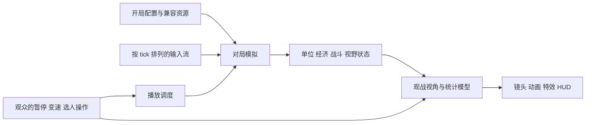

# 帝国时代 IV：观战与回放机制

检查日期：2026-09-13。依据本机 `RelicCardinal.exe`、`UI.sga`、`Data.sga`、英文文本资源、SCAR 文档和两份本地 `.rec`，结合官方说明与公开格式研究。只做静态读取和结构校验，没有启动观战、修改回放或抓取网络流量。

**核心结论：回放包含按逻辑 tick 排列的命令流，游戏可据此重演对局，再让观众选择镜头、迷雾和统计面板。实时观战则还需要处理持续到达的数据、观战延迟与访问权限。** 本次确认了命令流和相关界面接口；服务器如何传输、缓存及补发数据，仍属于未验证部分。

## 1. 本机证据及其边界

| 证据 | 本次确认 | 不能据此直接推出 |
|---|---|---|
| `.rec` 文件头 | 偏移 4 是 `AOE4_RE` 加零结尾；偏移 76 开始出现 Relic Chunky 容器 | 文件只包含玩家鼠标操作 |
| 两份回放的记录区 | 可完整遍历 tick、块、命令的长度边界，直至文件末尾 | 已经解码每条命令的语义或复现了胜负 |
| 程序字符串 | `PlaybackSynchronization::GetSyncCommand`、`IsPlaybackDeterministic`、`ReplayDesyncTest` | 网络一定是纯 P2P，或已掌握同步校验算法 |
| `UI.sga` | 回放暂停、变速、镜头跟随、玩家选择、迷雾模式、直播状态和延迟页面 | UI 中所有模式在所有平台、房间均可用 |
| SCAR 文档及脚本 | `UI_IsReplay()`、`World_IsReplay()` 和回放统计更新脚本 | 整个回放引擎用 Lua 实现 |

程序中还找到 `lockstep_simulation_presentation_toggle`，支持继续研究模拟与表现协调，但一个标识不能证明完整的联机拓扑、线程划分或同步协议。

## 2. `.rec` 实际记录了什么

本地文件位于“文档/My Games/Age of Empires IV/playback”。只报告结构统计，不发布回放、玩家身份、聊天内容或原作资源。

| 本机样本 | 文件大小 | 记录流起点 | tick 记录 | 命令记录 |
|---|---:|---:|---:|---:|
| `temp.rec` | 342,319 字节 | `0x58C` | 8,202，编号 1–8,202 | 2,865 |
| `temp_campaign.rec` | 3,618,035 字节 | `0x74F` | 3,035，编号 1–3,035 | 107,078 |

命令数包括内部命令、前后置记录和周期性记录，**不是鼠标点击数，也不能直接用来计算玩家 APM**。战役样本命令更多，不代表玩家操作更多。

两份样本包含 `FOLD:POST`、`DATA:SDSC`、`FOLD:INFO` 等块。INFO 内部可见 `DATA:DATA`、`DATA:PLAS`、`DATA:GRIF`；本机 `DATA:DATA` 版本为 60，`SDSC` 版本为 3025。本次跳过这些块的内容，按长度定位后续记录流，没有把旧版模板中的所有开局字段强行套到新版文件。

记录流的结构可概括为：

```text
回放标识及头部
  → Chunky 元数据 / 对局设置相关块
  → 记录流
      → tick 记录：tick 编号、若干数据块
          → 数据块：来源相关字段、负载长度
              → 命令：长度、类型、标志、玩家相关字段、负载
      → 其他记录类型，例如格式研究中识别的聊天记录
```

本次校验了容器范围、tick 单调递增、每块的命令长度及最终文件边界。校验依据参考 [公开的 replayData.bt 格式研究](https://github.com/ChipiKaf/aoe4-replays-api/blob/efc391296451da352c3660daf814403e37e787e8/docs/replayData.bt)，并用本机样本交叉验证。该模板仍是研究稿，含大量未知字段；同仓库的 `ReplayFullParser.Parse()` 尚未实现，不能称为完整官方解码器。

该研究稿把部分类型解释为训练、移动、建造、攻击移动等；本机也出现对应类型编号，但本次只校验封装结构，没有逐条核对实体和目标。模板把一个 tick 字段猜测为状态哈希，本篇保留它为未知字段；模板使用 8 tick/秒格式化时间，也不能据此认定当前版本所有模拟系统都以 8 Hz 更新。

## 3. 如何重演同一场对局

结合命令流、播放同步标识和版本校验，最有依据的理解是：**使用兼容版本的模拟逻辑，重建开局并按顺序执行记录中的模拟输入。** 画面随后由当前客户端重新渲染，因此可以移动镜头和切换观察对象。

下面是解释架构，不是恢复出的原作调用图：



要让这种设计复现同一结果，自建系统必须稳定处理随机数状态、命令顺序、实体 ID、寻路选择、脚本事件及并行计算顺序。只存地图种子不足以重演整场对局；地图生成版本、文明/模组配置和局内随机过程也影响结果。原作具体保存了哪些种子、地图数据或初始化快照，本次未完整解码。

AI 也是同样的问题：可以记录 AI 决策后的命令，也可以在严格确定性条件下重跑 AI，或混合处理。本次战役文件含大量命令，但不足以证明原作对所有 AI 都采用同一种方式。

## 4. 为什么更新后旧回放可能不能看

本机程序包含“回放版本与当前 build 不一致而忽略”的诊断字符串，说明加载过程存在版本检查。官方 [Patch 7989 公告](https://www.ageofempires.com/news/age-of-empires-iv-patch-7989/) 也明确说明该次更新后不能使用此前版本的回放。这是历史更新的确认，不表示每次补丁都必然失效。

从命令重演原理推断：即使命令序列没变，单位数值、寻路或脚本变化，也可能让后续状态分叉。因此“只改回放头部版本号”不能保证兼容。格式兼容和模拟结果兼容是两个独立条件。

## 5. 实时观战：持续输入、延迟和权限

本机有 `FrontEnd_IsLiveReplayGameCondition`、`IsObserverLive`、`ObserverDelay`、`AllowSpectators` 等标识；`observerdelaypage.xaml` 绑定延迟模型，并显示等待信息。英文文本资源说明延迟设置以分钟表达，并提及房主提供的观战密码可允许特定观众跳过延迟。这是功能文本证据，未实测当前房间规则，也没有读取或使用任何密码。

适合解释这一机制的模型是：已结束回放从现有记录读取输入；实时观战从持续增长的数据中读取输入，并受允许观看时间限制。原作究竟是持续下载回放片段、独立网络消息还是二者结合，本次没有抓包证据。

自建系统可这样限制播放前沿：

```text
可播放至 = min(已收到的完整数据前沿, 服务端授权观看的时间前沿)
观众播放位置 <= 可播放至
```

应由服务端或受信的数据分发层执行授权与延迟限制。把最新信息发给普通观众后只用 UI 遮挡，不构成可靠的信息隔离。这里是实现建议，不能声称原作已经采用了某种具体服务端方案。

中途加入时，系统需要取得开局以来的数据再追赶，或者取得可恢复的中间状态再继续。两种都是可行设计，本次没有确认帝国时代 IV 的中途加入快照策略。暂停观战只应停住本地播放时钟，原对局继续运行；恢复后可追赶到允许观看的前沿，不能越过它。

## 6. 玩家视角、自由镜头与战争迷雾分别处理

`ui/hud/controls/replaycontrol.xaml` 的绑定直接表明以下设置相互独立：

| 设置 | 本机绑定或枚举 | 作用 |
|---|---|---|
| 观察玩家 | `Replay.SelectedPlayer` | 选择关注的玩家 |
| 跟随镜头 | `Replay.IsFollowingReplayCamera` | 跟随记录镜头，或使用观众自己的镜头 |
| 迷雾模式 | `Replay.SelectedFOWMode` | 切换视野显示策略 |
| 迷雾选项 | `ReplayFOWMode.LocalPlayer`、`RevealAll` | 玩家视野与全图显示选项 |
| 播放时钟 | `TogglePause`、`Slower`、`Faster`、`CurrentSpeed` | 暂停和改变播放速度 |

程序还含 `ReplayCameraModule` 插值诊断字符串，支持镜头轨道单独处理的判断；没有解码具体的相机采样频率、轨道压缩和插值公式。

官方 [Observer/Replay 快捷键说明](https://news.xbox.com/en-us/2021/10/22/age-of-empires-iv-hotkeys-revealed/) 也列出自由镜头、迷雾、变速和玩家切换。该文发布于 2021 年，不能当作当前用户的自定义按键配置。

自建时，观战选择不应改变模拟中的玩家身份或真实视野状态。表现层根据所选玩家的视野筛选单位、地图和信息面板；切换镜头则只修改相机。观众选择某个单位查看属性，也不意味着获得给它下命令的权限。

## 7. 快进、回退和真正的时间回溯

本机 PC 回放控件的时间线是 `ProgressBar`，`CurrentProgress` 使用 `Mode=OneWay`。减速和加速分别绑定 `Slower`、`Faster`。Xbox 键鼠控件中，名字含 `fast_backward.png` 的图标也绑定 `Replay.Slower`，**图标朝左不等于回退到过去**。

这能确认被检查控件提供的是进度显示与变速，不能仅靠它证明所有版本、其他入口或外部工具都不支持跳转。本次没有实机验证回退能力，也没有找到足以确认原作周期性回放快照的证据。

命令重演系统的快进通常是在较少现实时间内推进更多逻辑步骤，必要时减少中间渲染；不能随意把模拟 dt 乘以倍速，否则移动、碰撞和事件顺序可能变化。这是实现原理，原作的精确快进调度未反汇编确认。

回退则不能简单地让 dt 变负：死亡、随机选择、资源消耗、寻路和实体销毁往往不可逆。自建项目可以选择：

| 方案 | 回退方式 | 代价 |
|---|---|---|
| 从开局重演 | 重建初始状态，再快速执行至目标 tick | 文件较小，较晚时间点的跳转可能慢 |
| 快照加命令流 | 加载目标之前最近的完整快照，再补跑命令 | 需要额外存储和完整状态序列化 |
| 保存表现状态历史 | 恢复单位位置、动画等可视状态供观看 | 能回看画面，但不一定能从该点继续正确模拟 |

这些是方案比较，不是帝国时代 IV 已确认采用的三套机制。

## 8. 观战统计与动画怎样跟上回放

`Data.sga` 中的 `scar/replay/replaystatviewer.scar` 会检查 `UI_IsReplay()`，注册统计更新回调，通过 `UI_SetDataContext` 把数据交给界面；启动函数有 `Rule_AddInterval(..., 5.0)`。这说明该脚本提供了周期性更新扩展统计的路径，**不能理解成所有观战数字每 5 秒才刷新，更不能当成游戏逻辑 tick 或动画帧率**。

`UI.sga` 还包含 Caster Mode 的军队概览、经济军事对比、科技队列、胜利条件等模板。官方 [Caster Mode 介绍](https://www.ageofempires.com/news/captureage-new-spectator-tool-ageiv/) 将其说明为对 Observer Mode 的展示增强；该公告描述的是 2022 年发布时的功能范围。

联系[动画分析](动画演示系统分析.md)：命令先推动模拟，模拟状态和事件再驱动动画表现。精确重现逻辑结果，并不要求每个粒子、镜头插值样本和渲染帧逐像素一致。自建系统在快进/跳转时还需清除旧特效、停止循环声音、重建单位表现，避免补跑十分钟时把十分钟的音效一次播放出来。

## 9. C++ 风格伪代码：用于自己的 ECS 与表现层隔离

以下是设计建议，所有类型及方法名均为解释性伪代码，不是原作源码，不对应 `.rec` 的完整二进制布局。

```cpp
struct ReplaySession {
    CompatibleSetup setup;       // 模拟版本、资源/模组版本、开局与随机数状态
    OrderedInputLog inputs;       // 包含所有影响模拟的必要输入，稳定排序
    OptionalSnapshotIndex index; // 自建功能：不能据此认定原作也有
};

void AdvancePlayback(double realDt) {
    if (paused) return;
    budget += realDt * playbackSpeed;
    Tick allowed = Min(inputSource.CompleteFrontier(),
                       inputSource.AuthorizedFrontier());
    int steps = 0;
    while (budget >= fixedStep && world.NextTick() <= allowed
           && steps < maxStepsPerRender) {
        Tick t = world.NextTick();
        world.ApplyInRecordedOrder(inputSource.ForTick(t));
        world.StepFixed();       // 倍速不改变模拟步长
        budget -= fixedStep;
        ++steps;
    }
    if (world.NextTick() > allowed)
        budget = Min(budget, fixedStep); // 等待数据期间不无限积累追赶预算
    view.Present(world.ReadOnlyState(), observerSettings);
}

void SeekTo(Tick target) {       // 自建的回退/跳转能力
    Require(target <= inputSource.AuthorizedFrontier());
    auto cp = session.index.NearestAtOrBefore(target);
    Tick start = cp ? cp.tick : session.setup.initialTick;
    inputSource.RequireCompleteRange(start, target);
    effects.ClearTransient();
    audio.StopWorldLoops();
    world.Restore(cp ? cp.fullState : session.setup.initialState);
    // 恢复须包含 RNG、实体 ID、队列、计时器、AI/脚本和视野等必要状态
    while (world.Tick() < target) {
        world.ApplyInRecordedOrder(inputSource.ForTick(world.NextTick()));
        world.StepFixed(SuppressTransientPresentationEvents);
    }
    budget = 0;
    view.RebuildFrom(world.ReadOnlyState(), observerSettings);
    audio.RebuildCurrentWorldLoops(world.ReadOnlyState());
}
```

C++/ECS 层拥有模拟状态、输入顺序和回放调度；蓝图或其他表现层接收只读视图及表现事件。暂停、变速、换镜头通过专门的播放/观战接口传递；普通观战端不进入战斗下令通道。视图重建时不继续持有恢复前已经失效的实体指针。

## 10. 已完成与未验证

已完成两份本机 `.rec` 的容器及记录长度校验，确认 UI 绑定、统计脚本与程序标识，并交叉核对公开资料。未运行第三方回放程序，没有实机复播验证最终胜负，也没有验证跨版本兼容、网络传输、延迟精度、中途加入状态恢复或完整快照内容。

因此，本篇可以解释“命令流如何支撑回放、观战如何在其上增加视角与时间控制”，但不能把示例架构当作已恢复出的 Essence Engine 完整实现。

本次安装文件的 SHA-256，供后续判断是否还是同一分析样本：

```text
RelicCardinal.exe
5380c577805565817f528af6eac385263413fa6815553f9a31fa62561cb45e8c
UI.sga
0632962ece126fe946e7a0f14506de12a50cb98233d6d1441905840fbb93e86a
```
