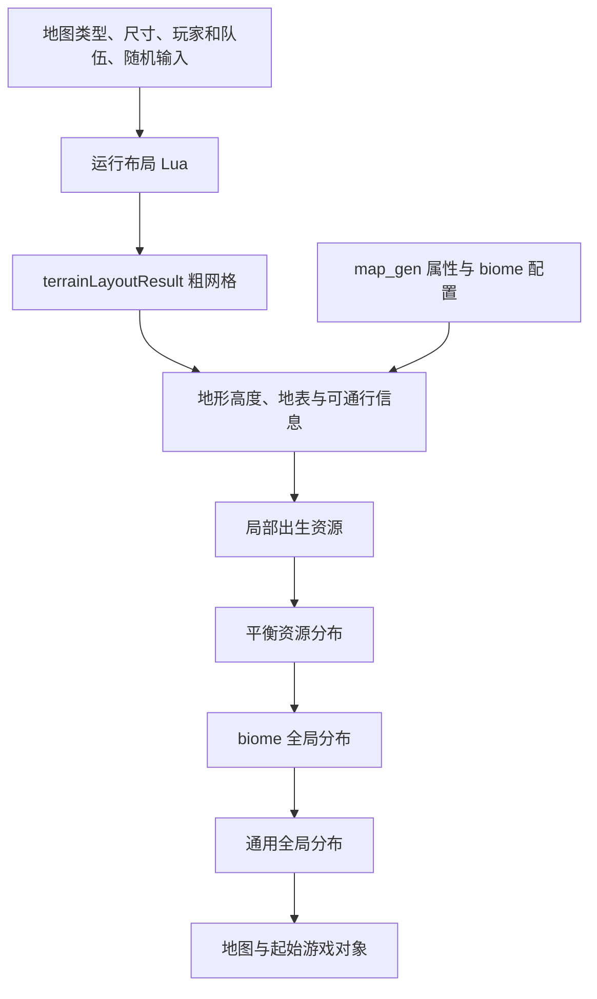

# 帝国时代 IV：随机地图的底层实现

检查日期：2026-09-13。安装路径：`D:\Game\steamapps\common\Age of Empires IV`。本篇结合本机地图脚本、编辑器参考属性与官方资料，附 C++ 风格伪代码；不包含原作资源或可编译实现。

**它采用的是“地图类型脚本 + 粗网格布局 + 地形细化 + 资源分布配置”的分层生成。** 地图名规定整体格局，随机过程改变出生位置、地形细节与资源布局。不能用“随机撒树”或单一噪声算法概括整个系统。

## 1. 本机实际读到了什么

本次读取 SGA v10 的文件目录，并按需解压数据，未修改安装文件。

| 资源包 | 本次读取结果 | 用途 |
|---|---|---|
| `cardinal/archives/Data.sga` | 11699 个条目，11530 个唯一内部路径；有重复路径 | 含地图 Lua、SCAR、状态树等资源 |
| 同上 | 成功读取 172 个匹配地形布局条件的 Lua/SCAR 文件，另有 13 个未解码 | 包含 `dry_arabia.lua` 和公共布局库；不是所有文件都是正式随机地图 |
| `cardinal/archives/ReferenceAttributes.sga` | 28186 个 XML 条目 | 编辑器参考属性，含 map_gen、武器等配置 |

**参考属性 XML 不能自动等同于当前联网对局最终生效值。** 本次没有合并所有运行时属性、变体、模组与热更新；下文具体数字均标为本机基础脚本/参考配置样本。

SGA 字段布局参照了 [sga-unpacker 的开源实现](https://github.com/BjornTheProgrammer/sga-unpacker)，实际读取时核对了目录条目数和解压长度。没有修改签名校验或加载外部游戏模组。

## 2. 地图类型如何连接脚本和配置

本机 `instances/map_gen/map_gen_layout/skirmish_maps/dry_arabia.xml` 指向 `skirmish_maps/dry_arabia` 布局脚本，并引用全局分布、地形权重与资源评分图。

Lua 文件负责生成 `terrainLayoutResult`。它是一个粗网格，每格可以写地形类型，出生格还可写 `playerIndex`。这张网格传给后续地形生成过程，不是最终每平方米一个格子的完整地图。

官方也明确区分：Lua 布局控制地貌与出生位置，Attribute Editor 中的 mapgen 数据控制资源及其分布。见 [官方 Generated Maps 概述](https://support.ageofempires.com/hc/en-us/articles/4869788243220-Introduction-to-Generated-Maps)。



图中的资源阶段顺序来自 [官方 Generated Map Basics](https://support.ageofempires.com/hc/en-us/articles/4865310033684-Generated-Map-Basics)：局部分布优先，然后平衡分布，再处理 biome 和通用全局分布。官方同时区分可控资源与争夺资源，以及局部/全局、区域/单元格两组分布概念。它们是不同维度，不能只用一个随机点列表代替。

## 3. 粗网格怎样确定大小

`scar/terrainlayout/library/map_setup.lua` 的 `SetCoarseGrid()`：

1. 以 `40` 为尺寸换算基准，对地图宽高除以该值后取整。
2. 偶数结果减 1，使网格保留中心行/列。
3. 默认最小分辨率为 `13`。

下面是直接按这段函数计算的示例，不是所有地图尺寸的枚举：

| 输入的世界宽度 | 除以 40 后四舍五入 | 调整后的粗网格宽度 |
|---:|---:|---:|
| 417 | 10 | 13，受最小值限制 |
| 513 | 13 | 13 |
| 641 | 16 | 15 |
| 769 | 19 | 19 |

因此不能断言“每个粗网格永远正好 40 米”。最小网格数、奇数调整和自定义网格函数都会改变实际映射。

## 4. 干燥阿拉伯的生成过程

本机 `scar/terrainlayout/skirmish_maps/dry_arabia.lua` 的主要步骤是：

1. `SetCoarseGrid()` 创建尺寸，`SetUpGrid()` 先填 `tt_none`。
2. 根据世界大小、是否随机分散队伍，设置出生距离等参数。
3. 创建队伍映射，调用 `PlacePlayerStartsRing()` 放置出生格及缓冲地形。
4. 扫描并记录出生坐标。
5. 把非出生位置的边界格设置为平原。
6. 选择一对边缘贸易站位置；双人局还进行位置筛选。

`tt_none` 的脚本注释说明，此类格子由地图配置的加权地形候选进一步决定。本机 Dry Arabia 参考 XML 中候选如下：

| 地形 | 权重 |
|---|---:|
| `tt_plains` | 50 |
| `tt_hills_low_rolling` | 10 |
| `tt_hills_gentle_rolling` | 20 |
| `tt_valley_shallow` | 12 |
| `tt_valley` | 8 |

它们合计 100，但不能直接解读成最终地图面积严格占 50%、10% 等：指定格子、出生缓冲区和后续地形处理都会改变结果。

一个容易看错的地方是：脚本前面还声明了 `startRadius`，但实际 `PlacePlayerStartsRing()` 调用使用的是 `startBufferRadius = 3`。分析参数必须沿调用链确认，不能只看第一个类似变量。

## 5. 出生点算法：候选筛选、评分与重试

`PlacePlayerStartsRing()` 的实际实现位于公共库 `map_setup.lua`，而不是同目录的 `player_starts.lua`。

它先处理队伍映射，然后构建可用格列表。可见的限制包括边缘缓冲、中心排除区、角落排除和不可通行地形附近的避让。名字虽然叫 Ring，其中心排除代码是对行列范围的判断，不能假设它一定按严格圆环方程计算。

放置阶段使用候选点距离排序和评分，并在一部分候选中随机选择。不同分支处理队伍数量与已有玩家位置，不是对所有空地等概率抽样。部分分支还会改写传入的 `topSelectionThreshold`，因此外层参数不一定贯穿全部流程。

失败处理可见 `playerSpaceShrinking = 0.2`、`teamSpaceShrinking = 0.2`，通过收缩距离和重新放置继续寻找解。这里是粗网格坐标尺度，不能直接把 0.2 当作世界米数。

## 6. 地形细化与资源评分

本机地形参考属性存在 `fractal_shift_amplitude`、`fractal_shift_variance`、`fractal_shift_direction_bias`、`height_over_width`，说明粗地形还会结合起伏参数处理。另有 `erosion_pass/coarse_features.xml` 和 `droplet/droplet_coarse_features.xml`，包含侵蚀 pass、水滴概率、加速度、阻力和侵蚀参数。

这些字段支持“系统具备分形位移/侵蚀配置”的判断，但本次没有还原对应原生数学函数，也没有证明每张地图都使用相同侵蚀配置。不能把它写成已确认的 Perlin、Simplex 或某种固定水力侵蚀公式。

资源位置则有单独的评分图。例如 `score_map/score_map/basic_land_resource_placement.xml` 用 `product` 组合边界避让、水域避让、不可通行区域处理、可达性要求、桥/渡口避让和出生区避让。它是由多个空间条件组合的配置图，具体见[随机地图的特殊处理](随机地图的特殊处理.md)。

## 7. C++ 风格伪代码

下面把已见到的职责重写成便于理解的模型。原生地形/分布求值器没有在此复刻。

```cpp
Map GenerateMap(MapConfig config, MatchSetup setup, RandomStream rng) {
    int columns = Round(setup.worldWidth / 40.0);
    if (columns % 2 == 0) --columns;
    columns = Max(columns, 13);
    int rows = ComputeRowsTheSameWay(setup.worldHeight);

    CoarseGrid grid(rows, columns, TerrainType::None);
    RunSelectedLayoutScript(config.layoutScript, setup, rng, grid);
    // 例如 Dry Arabia 在脚本内放出生点、缓冲平原和边缘贸易站。

    Terrain terrain = NativeTerrainBuilder(grid, config.terrainTypes);
    PlaceLocalDistributions(terrain, grid, config);
    PlaceBalancedResources(terrain, setup.players, config);
    PlaceBiomeGlobalDistributions(terrain, config.biome);
    PlaceGeneralGlobalDistributions(terrain, config);
    return AssembleMap(terrain, grid.playerMarkers);
}
```

```cpp
// 对公共库机制的缩略解释；省略不同队伍数量的分支。
while (!AllPlayersPlaced()) {
    auto candidates = FindLegalRingCandidates(grid, restrictions);
    auto ranked = ScoreCandidatesForTeams(candidates, teamMapping);
    if (TryPlacePlayers(ranked, rng, minimumDistances)) break;
    ClearThisAttempt();
    ShrinkSelectedDistanceConstraints(0.2);
}
```

上例展示原作可见的重试思路，不保证任意输入下收敛。自己实现时应增加明确的最大尝试次数和失败报告，而不是无限缩小约束。

## 8. 复现范围

本次完成的是静态脚本与配置分析，没有调用游戏生成器跑大量种子，也没有验证联网版本的同种子一致性。复现地图至少需要记录地图脚本版本、尺寸、队伍设置、biome、变体、随机状态和运行时属性版本，不能只保存一个种子。

原始包 SHA-256：

- `Data.sga`：`024c9dff30938315155b087a442940880a20a01fd4ce89295e9fd982d9d0d252`
- `ReferenceAttributes.sga`：`cbaf6803ca8309cfb3861c8a19c3c9c34c0ec50d7c6c507f9c6906be301cfe5c`

文档只保留分析、内部路径和少量字段名。解压出的原作脚本、属性与工具均未加入分析仓库。
