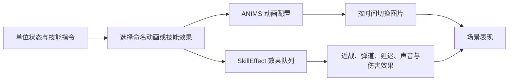

# 陷阵之志：动画演示系统分析

本机检查日期：2026-09-13。对象为 `D:\Game\steamapps\common\Into the Breach` 的安装脚本。本篇分析动画表现系统，包含资源帧数、播放节奏、动作组织和 C++ 风格伪代码；不提供可编译程序。

**可以确认的结构是：动画数据表描述序列图，技能脚本组装效果队列。** 状态选择、图片播放和攻击效果调度是不同职责。仅凭这些 Lua 数据，无法确认原生引擎内部采用哪一种状态机类，更不能认定它使用虚幻动画蓝图。

## 1. 一个动作到底用了多少帧

首先区分三个数字：素材中可用的图片数量、播放时经过的序列步骤、屏幕每秒刷新的画面数量。它们不相等。

以下来自 `scripts/animations.lua`。时长按 `Time` 表示每帧秒数解读，使用 `帧数 × Time` 计算；它们是配置对应的名义时长，没有通过游戏录像测量。继承项需要先合并父配置。

| 动画名 | 配置帧数 | 每帧时长 | 名义一轮时长 | 含义与注意点 |
|---|---:|---:|---:|---|
| `FireBack` | 4 | 0.19 秒 | 0.76 秒 | 循环火焰，约每秒换图 5.26 次 |
| `MechPuncha` | 4 | 0.30 秒，继承 | 1.20 秒 | 机甲命名片段；不能凭后缀 a 断定是攻击 |
| `MechTanka` | 3 | 0.30 秒，继承 | 0.90 秒 | 另一机甲命名片段，继承循环属性 |
| `BaseEmerge` | 10 | 0.15 秒 | 1.50 秒 | 出场动画基类，非循环，配置出场声音 |
| `piston_u_push` | 11 | 0.03 秒 | 0.33 秒 | 活塞推动，约每秒换图 33.33 次 |
| `ExploArt1` | 10 | 0.075 秒 | 0.75 秒 | 炮击爆炸，约每秒换图 13.33 次 |
| `Pilot_TimeTravel` | 10 | 0.08 秒 | 0.80 秒 | 驾驶员时间旅行片段 |

这些样本说明原作没有统一规定“一次动作必须 8 帧、12 帧或 60 帧”。不同用途采用不同帧数和停留时间。爆炸片段也不是完整攻击：攻击还可能包含位移、发射、弹道、受击、音效和等待。

### 同一个动画可以重复使用图片并改变停留时间

`Pilot_Look` 声明 `NumFrames = 6`，但播放顺序为 `0 → 2 → 0 → 1 → 0`，对应停留时间如下：

| 播放步骤 | 使用图片索引 | 持续时间 | 累计结束时间 |
|---|---:|---:|---:|
| 1 | 0 | 0.10 秒 | 0.10 秒 |
| 2 | 2 | 0.20 秒 | 0.30 秒 |
| 3 | 0 | 0.05 秒 | 0.35 秒 |
| 4 | 1 | 0.25 秒 | 0.60 秒 |
| 5 | 0 | 1.20 秒 | 1.80 秒 |

这里是 **6 张声明图片、5 个播放步骤、3 个被引用的图片索引、总计 1.8 秒**。长时间停留与短促切换直接编码在 `Lengths` 中，因此“帧数少”不等于“没有动作节奏”。

## 2. 底层资源和播放器如何分工

`Animation` 的默认字段包括 `Image`、`NumFrames`、`Time`、`Loop`、`Layer`、`PosX`、`PosY` 和 `Sound`。`ANIMS` 保存命名动画；`Animation:new` 及其派生配置复用默认值。

`Image` 指定图片资源，`NumFrames` 指定帧数量，`Frames/Lengths` 可描述自定义播放顺序和时长，`Loop` 表达循环设置，偏移和图层影响图片如何对齐场景。这里的配置继承并不是状态转换图。

例如 `MechPuncha` 没有直接写 `Time`，但其 `MechUnit → BaseUnit` 继承链提供 `Time = 0.3` 和 `Loop = true`。`Height = MechColors` 一类字段也不能乘进动作帧数；它涉及资源排列/颜色变体，不能当作额外的时间轴长度。

## 3. 是状态机，还是其他方式

可用下面的职责划分理解已有证据。这是结构解释，不是恢复出来的引擎类图。



单位存在多种图片变体，技能也能指定动画名称，说明系统需要进行表现选择。但选择逻辑可以写成条件分支、枚举状态机或其他调度代码；本次没有读到其完整原生实现。

技能层的证据更明确：`scripts/weapons_base.lua` 使用 `AddMelee`、`AddProjectile`、`AddDelay` 等效果接口，并出现 `NO_DELAY`、`FULL_DELAY` 参数。它们表明演出有队列和等待语义；精确阻塞规则仍取决于原生接口实现。

`scripts/weapons_enemy.lua` 的 `ScorpionAtk1:GetSkillEffect` 创建 `SkillEffect`，在伤害描述中填写 `sAnimation = "SwipeClaw2"`、攻击声音，再用 `AddQueuedMelee` 加入效果。带网版本另有声音和抓取效果。因此一次攻击不能简化为“播放单位的某张攻击序列图，播完扣血”。脚本没有给出“爪击第几张图扣血”的数字。

## 4. 为什么少量图片仍然可以有清晰、连贯的动作

已经确认的是：原作按用途配置不同换图速度，并支持不同图片的停留时间。火焰与快速活塞就使用明显不同的节奏。

从表现系统设计上，图片换帧和物体在屏幕上的位置更新可以分开。即使图片保持不变，位移、弹道或镜头也可以继续更新。这解释了为什么素材帧数不能直接代表整体流畅度，但本次没有测定原作采用的具体插值函数。

“流畅”还包含起手是否清楚、命中是否及时、恢复是否拖沓。增加图片数量本身不能保证这些效果。也不能根据 `Time = 0.03` 推断整个游戏只运行在 33 FPS；那只是这个片段的名义换图频率。

## 5. C++ 风格伪代码：按时间播放，不按渲染次数换图

以下是用于理解的播放器模型，不是原作源码。假设输入已完成继承合并、步数非零且所有停留时长均为正。

```cpp
struct Clip {
    Array<int> imageIndex;       // 普通片段为 0..N-1；也可重复图片
    Array<double> holdSeconds;  // 自定义 Lengths，或重复使用 Time
    bool loop;
};

void Start(Clip clip) {
    current = clip;
    step = 0;
    elapsed = 0;
    finished = false;
    ShowImage(current.imageIndex[step]);
}

void Tick(double deltaSeconds, double playbackSpeed) {
    if (finished || playbackSpeed <= 0) return;
    elapsed += deltaSeconds * playbackSpeed;

    // 一次更新可能跨过多步，不能只用一次 if。
    while (elapsed >= current.holdSeconds[step]) {
        elapsed -= current.holdSeconds[step];
        if (step + 1 < current.imageIndex.size()) {
            ++step;
        } else if (current.loop) {
            step = 0;
        } else {
            finished = true;
            NotifyPresentationFinishedOnce();
            break;  // 示例选择保持最后一张图
        }
    }
    ShowImage(current.imageIndex[step]);
}
```

非循环结束后保持、隐藏还是销毁，应由具体表现任务决定；上例的保持策略不是对原作的断言。循环火焰也不能成为“整个回合必须等待完成”的任务，否则回合永远无法结束。

效果组织可以这样理解：

```cpp
EffectPlan DescribeAttack(Unit actor, Tile target) {
    EffectPlan plan;
    DamageSpec damage = DescribeDamage(target);
    damage.animation = "SwipeClaw2";  // 本机脚本可见的动画键
    damage.sound = ResolveAttackSound(actor);
    plan.QueueMelee(actor.position, damage);
    return plan;
}

// 表现调度器负责效果何时启动、何时结束。
// 不在普通图片换帧循环里反复计算战斗伤害。
// 原作伤害提交的精确时点，需要继续检查原生实现才能确定。
```

## 6. 如果制作一个辅助理解的动画演示面板

建议面板显示：片段名、当前图片索引、播放步骤、该步停留时间、累计时间、循环开关、播放倍率，以及效果队列的当前任务。提供暂停、单步和时间拖动，分别观察“图片切换”和“效果开始/结束”。这是演示系统设计建议，本仓库仅提供分析文档。

用 `Pilot_Look` 可以演示重复图片和不等长停留；用 `FireBack` 与 `piston_u_push` 可以比较相同屏幕刷新条件下不同的换图节奏；用一次近战可以演示单位、攻击特效和声音各自拥有生命周期。

为保持演示可信，应把示例命中标记显示为“自定义”，直到能取得原作事件时序证据。暂停或拖动演示时间轴不应重新修改真实战斗数据；掉帧时跨过的事件需要按区间处理并防止重复触发。这些是建议实现的特殊处理，不是已确认的原作细节。

## 7. 证据位置与范围

| 本机相对路径 | 关键位置 | 支持的结论 |
|---|---|---|
| `scripts/animations.lua` | `Animation`、`Pilot_Look`、`FireBack` | 序列图字段、自定义顺序和停留时间 |
| 同上 | `BaseUnit`、`MechUnit`、`MechPuncha` | 配置继承；默认帧间隔不能漏算 |
| 同上 | `BaseEmerge`、`piston_u_push`、`ExploArt1` | 不同用途采用不同帧数与速度 |
| `scripts/weapons_enemy.lua` | `ScorpionAtk1:GetSkillEffect` | 动画与声音关联到近战效果描述 |
| `scripts/weapons_base.lua` | 效果添加接口及延迟参数 | 技能演出存在效果组织和等待语义 |

本次没有运行游戏逐帧录像、注入代码或还原原生播放器。渲染 FPS、实际命中帧、暂停与加速行为、完整状态转换优先级仍未确认。文中的数字是本机脚本配置及其计算结果。
