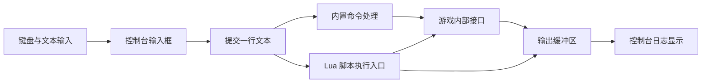

# 陷阵之志：控制台与回溯机制

检查日期：2026-09-13。依据本机 Lua 脚本、`Breach.exe` 的字符串及局部反汇编、已有 `undoSave.lua` 的结构。没有启动游戏执行控制台命令，也没有修改配置或存档。

**控制台是游戏内部的文本输入、命令分派和 Lua 调试入口。回合回溯则有独立的存档恢复路径：本机程序的 `undoturn` 分支明确传入 `undoSave.lua`。** 控制台负责发出请求，存档/战斗系统负责恢复状态。

## 1. 怎样打开，它与普通终端有什么关系

Windows 版通常使用键盘数字 1 左边的反引号/波浪号键打开。这个入口以及 `help`、`undoturn` 等命令有早期模组作者的一手操作记录，见 [Subset 官方论坛中的模组研究帖](https://subsetgames.com/forum/viewtopic.php?f=26&t=32771)。这是论坛用户的实验记录，不是官方接口规范；键盘布局可能影响按键。

这里的控制台由游戏接收输入并调用内部功能。不要把它当成 PowerShell/CMD：例如 `undoturn` 的含义由游戏定义。即使可执行文件导入了 `WriteConsoleW`，单凭这一点也不能认定屏幕上的控制台是 Windows 终端窗口。

本机证据包括：

| 证据 | 能确认什么 |
|---|---|
| `Breach.exe` 包含开发者控制台提示、`Command unrecognized`、`lua > ` | 存在控制台提示和命令/脚本交互线索 |
| 安装目录包含 `lua5.1.dll`，程序包含 Lua 加载/调用接口名 | 游戏嵌入 Lua，具备从文本加载和执行脚本的基础 |
| `scripts/global.lua` 的 `LOG` 调用 `ConsolePrint` 和 `print` | Lua 日志可以进入游戏控制台输出通道 |
| 原生分支识别 `save`、`undoturn`、`undolast` | 控制台至少有原生命令处理路径 |

所以比较准确的结构解释是“游戏 UI + 原生命令分派 + Lua 执行能力”。不能仅从字符串就确定原生命令和 Lua 的尝试顺序、历史缓存容量或全部快捷键。

## 2. 内嵌命令行怎样实现

下面是与已知证据相符的解释模型。图中的具体类划分不是原作类图。



常见实现需要输入行、光标位置、滚动日志、命令解析器、错误输出和输入焦点。打开控制台时应把打字事件交给输入框，避免同时触发游戏操作；这是实现建议，本次未还原原作的完整输入处理。

Lua 与 C++ 的连接可以通过注册函数/对象接口完成：脚本调用 `ConsolePrint`、`Board`、`Game` 等入口，宿主处理实际工作。Lua 5.1 官方文档说明，宿主可以注册 C 函数，也可以把字符串加载成脚本块并通过保护调用执行，见 [Lua 5.1 C API](https://www.lua.org/manual/5.1/manual.html#3)。

```cpp
// 说明性伪代码；原作命令与 Lua 的分派顺序未完全还原。
void SubmitConsole(string text, InputMode mode) {
    if (mode == NativeCommand) {
        ParsedCommand cmd = ParseCommand(text);
        DispatchGameCommand(cmd);
        return;
    }

    int oldTop = lua_gettop(L);
    int error = luaL_loadstring(L, text.c_str());
    if (error == 0) error = lua_pcall(L, 0, LUA_MULTRET, 0);
    if (error != 0) ConsoleOutput(ReadLuaError(L));
    else DisplayReturnedValues(L, oldTop);
    lua_settop(L, oldTop);  // 成功、失败都清理本次调用留下的栈内容
}
```

上述“显式选择输入模式”是讲解方案，不是声称原作有这个 UI。`luaL_loadstring` 只负责加载；执行发生在调用阶段。保护调用能报告 Lua 错误，但不是隔离任意原生错误的安全沙箱。

## 3. 已经追踪到的回溯命令路径

为避免只凭命令名字猜测，本次追踪了字符串的代码引用。下列 VA 是该二进制的静态首选地址，不是经过 ASLR 后的运行时地址。

| 命令分支 | 关键代码位置 | 分支传入的文件名 | 后续调用 |
|---|---|---|---|
| `undoturn` | `0x0060A4B8` 开始引用命令字符串 | `undoSave.lua`，在 `0x0060A4D3` 传入 | `0x00609900` |
| `undolast` | `0x0060A487` 开始引用命令字符串 | `undoLastSave.lua`，在 `0x0060A4A2` 传入 | 同一个 `0x00609900` |

该被调函数还包含文件检查、加载失败和尝试备份的分支，支持把它识别为存档加载路径。这里不是根据 `undo` 一词推测功能。

因此可以用以下伪代码概括已追踪部分：

```cpp
if (MatchesCommand("undoturn"))
    LoadGameStateFromFile("undoSave.lua");
else if (MatchesCommand("undolast"))
    LoadGameStateFromFile("undoLastSave.lua");
```

函数名是人为命名。`undoLastSave.lua` 在本次检查的用户目录中不存在，不能据此宣称它当前可用，更不能把 `undolast` 描述为“无限逐动作撤销”。文件的写入时机与覆盖策略还未完全追踪。

## 4. 回溯恢复的是什么

本机存在 `Documents/My Games/Into The Breach/profile_Alpha/undoSave.lua` 及其备份。仅统计其结构，不把用户完整存档纳入仓库。

该文件包含 `GameData`、`RegionData`、`GAME`、`SquadData` 等顶层数据。可见的字段包括：

| 状态类别 | 本机实际字段示例 | 为什么不能只恢复单位坐标 |
|---|---|---|
| 回合与行动 | `iTurnCount`、`iTeamTurn`、`iCurrentTurn`、`bActive` | 行动阶段、是否还能行动也会影响结果 |
| 棋盘 | `map`、`terrain`、`smoke`、`health_max` | 地形、烟雾和建筑状态需要与回合一致 |
| 单位与局部撤销 | `health`、`max_health`、`undoPosition`、`undoReady`、`undo_state` | 撤销可能影响生命与行动条件 |
| 敌人意图 | `iQueuedSkill`、`piQueuedShot`、`piTarget` | 敌人已排定的攻击也属于战斗状态 |
| 任务与环境 | `Missions`、`Spawner`、`LiveEnvironment` | 刷怪、环境事件和任务进度不能遗漏 |
| 随机相关 | `seed`、`aiSeed` | 至少保存了随机相关字段；不是完整 RNG 状态布局证明 |
| 回溯标记 | `undosave`、`iUndoTurn` | 回溯资格和次数需要单独理解 |

这支持“保存逻辑状态，再重新载入”的实现路径。没有证据表明它为了 Reset Turn 逐帧保存整个画面，再反向播放并反演所有运算。

Lua 层也有对应的序列化与重建：`scripts/game.lua` 的 `SaveGame()` 把 `GAME` 交给 `save_table` 输出成 Lua 数据；`LoadGame()` 重建 `GameObject` 并调用 `ReloadMissions()`。后者依据任务 ID 重建任务、Spawner 和环境对象。这说明至少脚本状态采用“数据序列化 + 对象关系重建”。它不等于全部战斗状态都由这一段 Lua 保存；棋盘等仍有原生层参与。

## 5. 三种看起来相似的“回退”

| 功能 | 证据支持的作用 | 不应混同之处 |
|---|---|---|
| Undo Move | 文本明确称撤销机甲最近一次移动；存档有移动撤销字段 | 不是任意攻击都可以撤销 |
| Reset Turn | 回到当前回合开始，基础规则每战一次，特定驾驶员额外增加一次 | UI 限额与调试命令的资格检查不能直接等同 |
| 战役时间线跳转 | 有驾驶员及机甲时间旅行表现资源 | 不等于加载当前回合撤销存档，其完整持久化路径未分析 |

Reset Turn 的规则直接来自 `scripts/text.lua` 的 `TipText_ResetTurn`、`TipText_ResetTurnExtra` 等文本。实际允许撤销移动的完整条件位于更深的规则实现，本次未穷举。

还有一个具体的特殊处理：`scripts/advanced/missions/grass/mission_repair.lua` 在更新维修拾取数时，加上 `EVENT_REPAIR_PICKUP`，再减去 `EVENT_REPAIR_UNDO`。这证明撤销不仅处理视觉位置，也有任务计数补偿。否则玩家可能靠反复移动/撤销多算任务进度。

如果“回溯”指命令行按上键找旧命令，那属于命令历史，只需保存输入文本并移动历史游标，与战斗快照无关。本次没有确认《陷阵之志》历史键位与持久化格式。

## 6. C++ 风格伪代码：可靠的回合快照

以下是供自己的 ECS 战棋参考的设计，不是原作完整代码。快照保存逻辑数据和稳定实体 ID；蓝图表现对象、纹理句柄和粒子实例不直接序列化。

```cpp
struct TurnSnapshot {
    WorldData entitiesAndComponents;
    BoardData board;
    TurnData turn;
    MissionData mission;
    PendingIntentData enemyIntents;
    RandomState randomState;  // 保存实际状态或等价信息，不只是最初种子
};

void BeginPlayerTurnAtStableBoundary() {
    turnStart = CaptureLogicalSnapshot();
}

bool ResetTurnFromUI() {
    if (!CanResetNow() || resetBudget <= 0) return false;

    // 先在临时世界重建并验证，失败时不破坏当前世界。
    auto restored = BuildValidatedWorld(turnStart);
    if (!restored) return false;
    int remainingBudget = resetBudget - 1;

    BlockGameplayInput();
    ++presentationGeneration;  // 让旧动画和延迟回调失效
    CancelOldPresentationTasks();
    SwapLogicalWorld(restored);
    resetBudget = remainingBudget;  // 不让快照把次数也恢复成可无限使用
    RebuildViewsAndIntentPreview();
    UnblockGameplayInput();
    return true;
}
```

快照必须在稳定的逻辑边界建立，并实际深拷贝/序列化需要保存的数据，不能只是复制指针。恢复后还需重建实体引用、寻路缓存、攻击预览和 UI。外部成就、统计上传等持久化副作用不能靠替换内存自动撤回，需要单独的提交策略。

若只实现单步移动撤销，也可以保存有限的修改记录，但必须覆盖沿途拾取、状态变化和任务计数；只写 `position = oldPosition` 不足以代表通用撤销。

## 7. 检查边界与复核定位

本机 `Breach.exe` SHA-256：`31fe352655982398fb3ee8b0bbe80efd5d65e3a9aa11e3dc39d0364354493fe9`。地址只对应这一文件。

已确认命令到回溯文件的原生分支、脚本序列化/重建入口和存档字段。尚未确认每个快照的精确写入时机、所有随机流的恢复策略、控制台命令在每个游戏阶段的限制，以及完整的移动撤销补偿清单。本篇是静态分析，没有声称完成实机回退测试。
